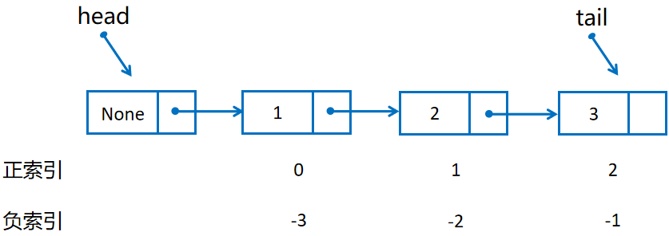

## 链表 Linked List

### 单链表 Single Linked List




单链表，也称单向链表 (Single Linked List)，由许多节点连接而成。单个节点由两部分 (value 和 next) 组成，value 用于存储数据，next 用于存储下一个节点的引用 (也可以理解为一个指针，指向下一个节点)。

通常我们会在链表的开头添加一个哨兵节点 (sentinel) 作为伪头 (pseudo-head)，可以简化插入、删除等操作。哨兵节点不计入链表长度，也无法用索引访问。

我们还有两个字段 head 和 tail，用于存储头节点和尾节点的引用 (也可以理解成头指针和尾指针，指向头节点和尾节点)。


### 双链表 Double Linked List

 双链表，也称双向链表 (Double Linked List)，由许多节点组成，每个节点包括存储数据部分，还包括前缀指针 (pre) 指向前一个节点，后缀指针 (next) 指向后一个节点。


### 1. 链表的创建

创建空链表

```python
linked_list = LinkedList()
```

初始化一个链表

```python
linked_list = LinkedList([1, 2, 3])
# 或者
linked_list = LinkedList('123')
```

> 注意传入的参数需要是一个序列类型


### 2. 访问链表元素

可以采用索引的方式访问链表元素

```python
elem = linked_list[1]
```


### 3. 修改链表元素

```python
linked_list[1] = 'hello'
```


### 4. 获取链表长度

```python
length = len(linked_list)
```


### 5. 链表方法

- append
- insert

